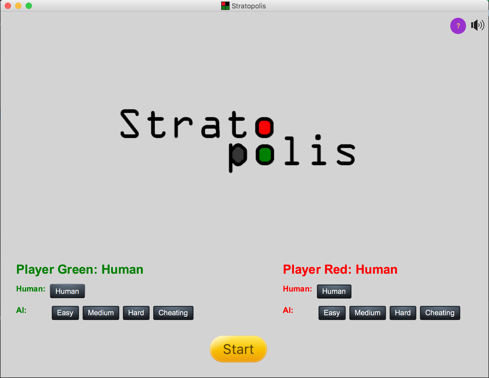
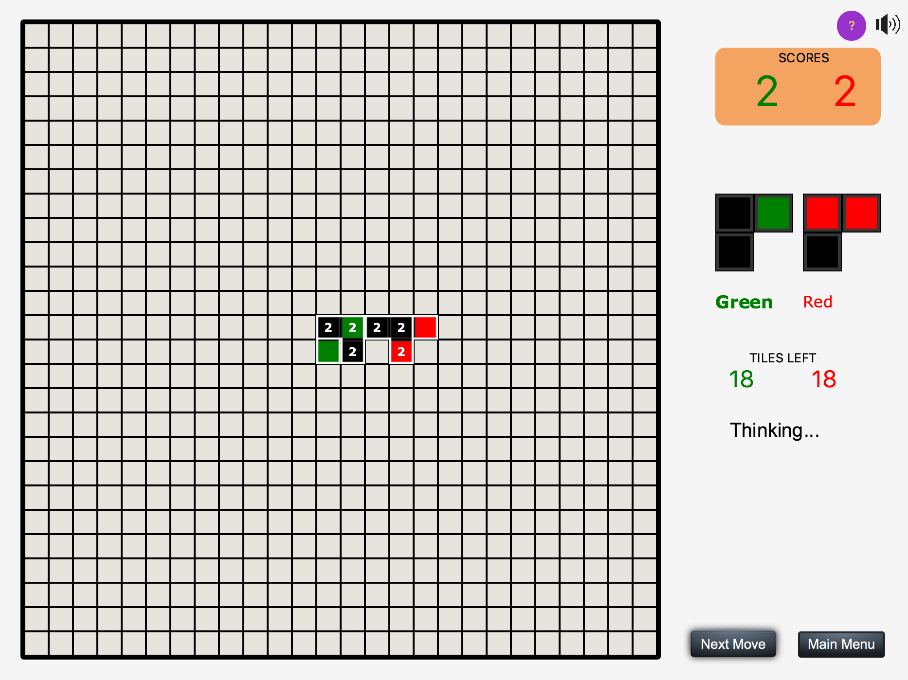
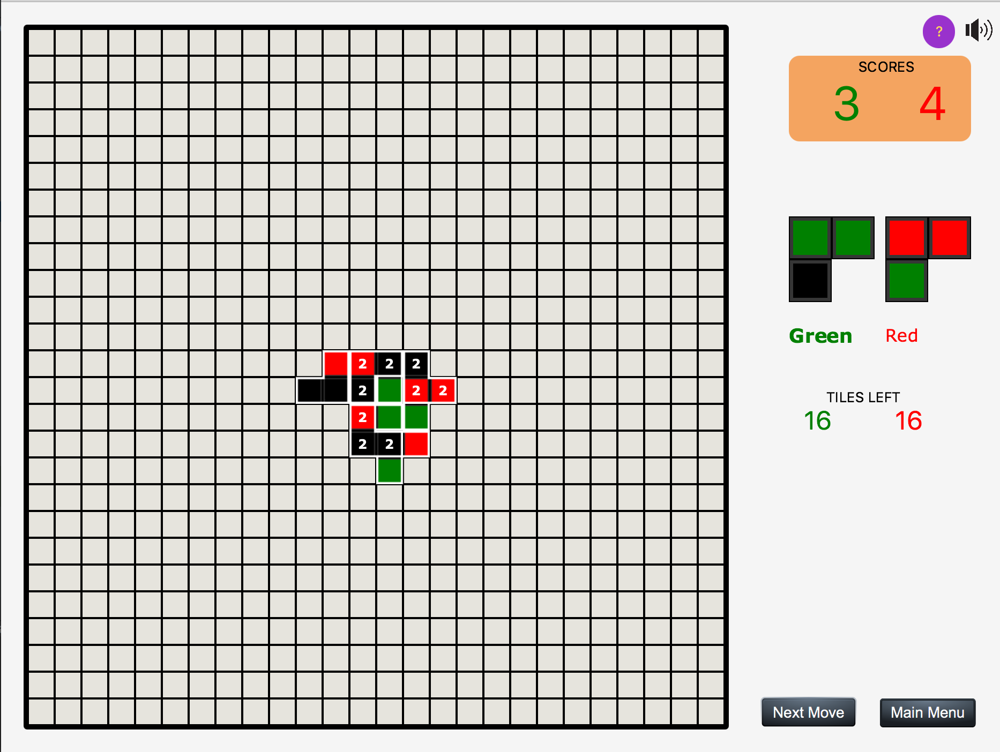
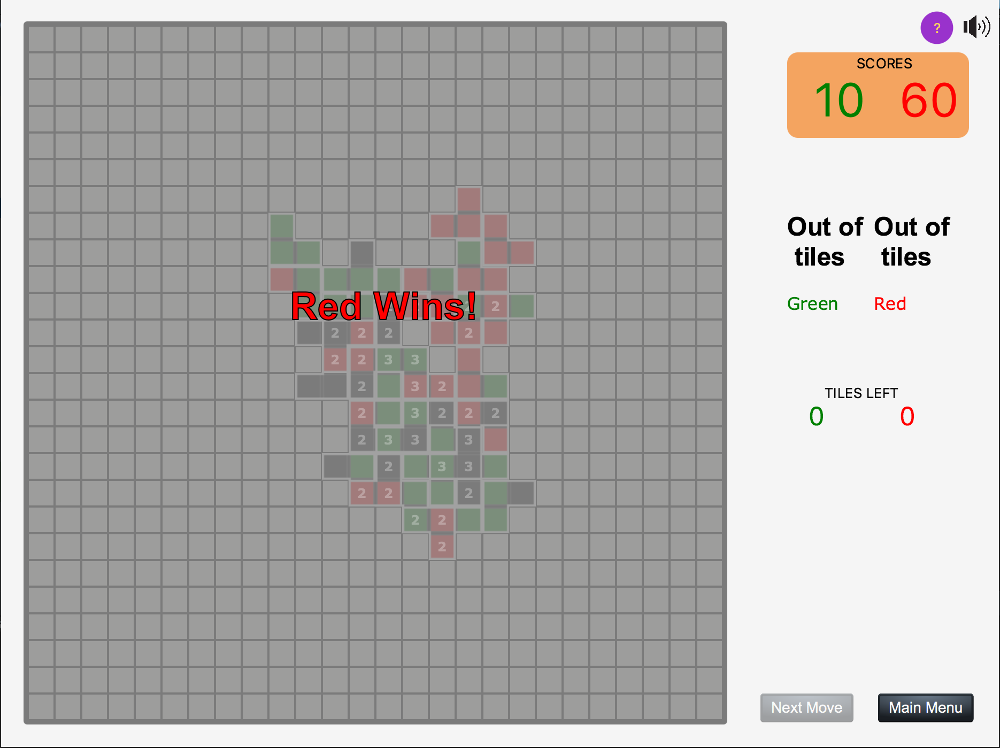

# Stratopolis
___

Stratopolis is a strategy based board game. This game was implemented in Java using JavaFX for an assignment for the "Introduction to Software Systems (Advanced)" course at the Australian National University in mid 2016.

Stratopolis is a two player game. We have added the option to play human vs human, human vs bot and bot vs bot. The bot uses alpha beta pruning to search for the best move. There are three different AI levels which correspond to varying maximum search depths.

To play the game, click the `clone or download` button and open the `game.jar` file. 

## Screenshots from the game

## Contributors

* Manal Mohania
* Joseph Meltzer
* Zhixian Wu